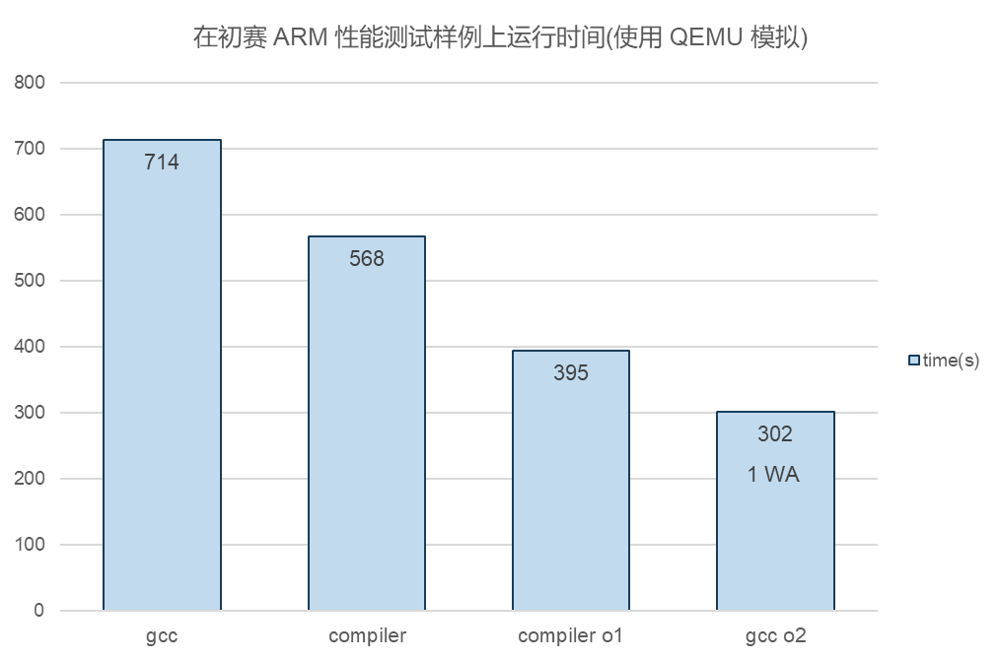

# Compiler2025-SysY

Compiler2025-SysY(CSY) 是一个对 SysY, 一个 C++ 的子集的 arm 指令集编译器。


## 结构

不同功能的组件位于 `include`和 `src` 的不同目录。

CSY 使用 ANTLR 进行词语法分析。ANTLR 词语法分析器由 ANTLR 从 EBNF 生成，置于`./antlr`，见 [README](./antlr/README.md)。

通过 ANTLR 得到语法树后，CSY 通过 DFS 遍历树生成抽象语法树 AST，置于 `ast` 目录，见 [README](./include/ast/README.md)。在 AST 模块，CSY 会进行语义检查。

CSY 使用 LLVM IR 作为机械无关中间代码，这部分置于 `ir/ir` 目录，见 [README](./include/ir/README.md)。LLVM IR 通过 DFS 遍历 AST 来生成。

CSY 采用图着色寄存器分配作为后端的寄存器分配方式。其实现与 "现代编译原理 C 语言描述" 所述相同。

## 编译

CSY 使用 C++ 17 语言标准，CMake 进行构建，其本体可以在 Windows 和 Linux 平台进行编译。使用指令：

```
cmake --build build --target compiler
```

CSY 依赖于 ANTLR runtime 运行。

## 测试

[测试脚本文档](tests/README.md)

目前提供使用 gcc 的测试脚本 `compilerTest.sh`，对 ast 的测试脚本 `astTest.sh`，对 ir 的测试脚本 `irTest.sh`，对 ir o1 的测试脚本 `passesTest.sh`，对编译器整体的测试脚本 `codegenTest.sh` 和 `codegenO1Test.sh`。

这些脚本以及评测脚本本体均用到了 qemu aarch64，若要更改为其它架构，也要相应做出更改。

若要运行编译器本体，使用指令

```
compiler -S -o <目标文件路径> <源文件路径>
```

编译器拥有可选选项

`-O1` 开启全部优化

`-ast` 从 AST 生成其对应的 C 代码作为输出，而非汇编输出

`-ir` 输出标准的 LLVM IR 作为输出

后二选项可以与 `-O1` 配合使用，但未支持具体开关优化而不重新编译。

## 性能评估



速度相较 GCC 有较大提升，但是距离 O2 还有一段距离。O2 使用激进的优化策略，在 sort_search 样例上产生了 WA，这是未定义行为导致的。


## 通用库

CSY 实现了一些通用组件，以便于项目代码的构建。这些库放在 `util` 目录中。见 [README](./include/util/README.md)。
