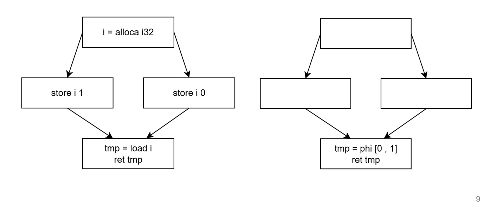

# 优化概述

## Mem2Reg

我们从 AST 生成 IR 进行如下转换


在 IR 中使用的 i = alloca i32 会被存储在栈中，而对 i 的内容只能用 load/store 访问，这是很大的开销。

Mem2Reg 将 i 从内存变量转换为寄存器变量：


当不能确定 i 具体值时，插入 phi 节点。phi 在后端被转换为前驱基本块的 mov。



mem2reg 是必须实现的 pass，因为后续一些 Pass 不支持从内存读取指针，这会给分析带来混乱。

## DeadCode

DeadCode 运行死代码。

DeadCode 首先删除不可达基本块。不可达基本块是**从入口不能到达的块**而非**没有前驱**的块。这是必做的，因为不可达块会使 Dominator 的支配树算法出错。

然后需要删除未使用指令。可以先标出有副作用指令，然后再标记其操作数有副作用，直到收敛，然后删除其它指令，这也是必做的。

至于删除函数参数，局部变量等可以不做。我们的编译器即使不加 O1 选项也会包含这两个优化。


## CriticalEdgeRemove

一个 phi 在后端会转换为其所有前驱的 mov 指令。如果一个块具有多个后继，它不可能做到只在到达某个特定后继时进行 mov，所以要在它们之间加一个基本块。

## CmpCombine

条件比较的值会被存到 NZCV 寄存器，该寄存器有且只有一个。

所以如果某 cmp 会多次使用，需要

- 用 cset 保存它
- 在使用之前用 cmp 加载

另外即使只有一次，如果使用和定义不贴着，也需要移动指令，防止中间寄存器被破坏。

你也可以使用更精确的策略，因为目前这个做法类似于 NZCV 被 spill 了。

**现在已经完成了跑起来后端所需要的所有优化。一些优化也可以简化：**

## FuncInfo 

FuncInfo 使用了复杂的指针溯源来分析某个函数具体存储和加载了哪些值。如果你不关心这个，可以退化为检查函数是否是纯函数（只关心是否存储加载值，不关心是哪些）。


# 优化评估

## LICM

LICM 外提循环不变量。FFT 系列样例在循环中调用了复杂纯函数，矩阵乘法系列在循环中使用了固定数组下标，LICM 将其外提均得到了超过 30% 性能提升。


由于循环可能根本不会进入，这也许会造成负优化。目前的样例应该可以暂时忽略这点，否则你需要进行 LoopRotate。

要运行 LICM，你只需要 LoopInvariantCodeMotion 一个 Pass，但为了支持 LoopRotate，需要

```C++
pm->add_pass<LoopSimplify>();
pm->add_pass<LoopInvariantCodeMotion>();
pm->add_pass<LCSSA>();
pm->add_pass<LoopRotate>();
pm->add_pass<GlobalCodeMotion>();
```

我们目前实现的策略会导致 loopRotate 后循环不变量跑到 loop guard 前面，所以必须运行 globalCodeMotion 将其推后。

当然，更简单的做法是在 AST 中将 while 变成 do while，我们也提供了这个 Config 选项 `loopRotateAndAddGuardInAST`。

LICM 会加大寄存器压力，对于普通的寄存器压力，后端的 SINK 优化可以很好的处理这一点，无论 spill 寄存器的多少。

然而对于 cmp 指令而言，如果 LICM 将其外提，其因为使用地点在别的基本块，会生成一个 CSET，占用一个寄存器。当进行 sink 时，程序发现 cmp 指令设置了 nzcv，而 cset 使用了 nzcv，若你不能识别它而将二者一起 sink，由于 nzcv 无法保证跨块保存（它是物理寄存器），它们会在原地锁住无法移动，导致 sink 失去效果。

我们的解决方式是将 cmp 锁定在循环里，禁止 LICM 外提 cmp 指令。你可以通过 disableCondLICM 配置这一点。

## INLINE

inline 进行函数和基本块内联，就测试而言，只有函数内联是有效果的。

crypto 系列对 or and 等基础函数均使用了函数调用，将它们内联得到了接近 80% 的性能提升。if_combine 系列没有可以内联的函数，暂时不知道基本块内联如何导致其性能下降。基本上只有函数内联存在收益。


我们使用 Config 选项 `funcInlineGate` 配置多小的函数需要内联。


## 强度削弱

强度削弱使用下图的不变式：


乘法不变式总是成立，例如 a x 3，可以被编码为 ADD W0, W1, W1, LSL #1，所以也适合进行削弱表示。我们 ir 中添加的 mull 指令就是为了支持此操作。

我们发现对于乘法的削弱没有显著效果，也可以只实现 x 2 的版本，因为它足够简单。

SysY 没有无符号整数，而对于负数，除法和模不变式并不总是成立，我们使用两了种解决方案：

- 若 $a \% 2^k$ 只在与 0 比较时使用，则它无论正负结果都正确
- 根据 C 标准，有符号溢出是未定义行为，通过常数，数组索引等已知符号的数，可以将符号在表达式之间传播，最终发掘更多正整数，从而可以进行优化。

由于测试样例中发生了很多的有符号数溢出，无法使用符号传播来进行除法和模的优化。目前最有效的优化来源于与 0 比较时的模优化（h1 和 matmul 系列），这产生了 20% 的性能提升。


我们不建议使用符号传播，因为未定义行为会导致其 WA，如果一定要使用，可以使用 Config 选项 `useSignalInfer` 来开启。


## 数组转置

当一个循环类似于

```
for(int i = 0; i < n; i++){
	for(int j = 0; j < n; j++){
		a[j][i] = b[j][i] + c[j][i];
	}
}
```

内层循环和外层循环好像写反了，导致不旦不能将左边的第一重索引外提到外层循环，还有很严重的缓存未命中。

正确的做法是使用 Loop Interchange，正如在 LICM 所言，循环相关工具链难以实现（尤其是完整支持需要 ScalarEvolution，很多优秀参赛队伍也未实现 ScalarEvolution，而是使用我们编译器的简单循环归纳变量检测方法）。

我们发现，只是单纯的将索引 i, j 交换变成


```
for(int i = 0; i < n; i++){
	for(int j = 0; j < n; j++){
		a[i][j] = b[i][j] + c[i][j];
	}
}
```

立刻就能取得较好效果。实现方式具体是将某二维并且两个维度相等的数组的所有 getelement 的 i j 倒过来。具体有诸多限制，见 GlobalArrayReverse Pass。

对于 matmul 和 h11 有 20% 性能提升


## 尾递归消除

尾递归消除是生成 MachineIR 时进行的优化。当发现函数返回值是对自己调用时，跳转到函数入口而非进行函数调用。在主要瓶颈来自尾递归的 h1 系列样例取得了接近 50% 性能提升。


使用 Config 选项 `removeTailRecursive` 来开启或关闭。


## SINK/REG SPILL

SINK/REG SPILL 是后端优化，sink/reg spill 目的是减少寄存器分配后 spill 到栈产生的 load/store 数量。

sink 是在需要的寄存器较多时，将目前的指令尽可能推迟计算（甚至移入循环），发生在寄存器分配时的 rewriteProgram 中。

reg spill 将需要 spill 的寄存器存到 SIMD 寄存器而非栈中。这发生在寄存器分配之后，仅使用了 8 个 callee-save SIMD 寄存器（如果未用到）的后 64 位。

使用未用到的 callee-save 寄存器可以防止给寄存器分配造成压力，使用后 64 位是因为寄存器的高 64 位没有义务跨调用保存。

实际测试中，SINK 的效果较大，reg spill 更多是理论效果，不应当对 reg spill 抱有效果期待。它们是独立的，可以只实现 sink。

if-combine 系列具有较大寄存器压力，sink/reg prefill 可以得到 10% - 20% 的性能提升。


**以下 Pass 慎重考虑，它们具有一些问题或者效果不显著**

## SignalSpread

这还包括所有通过 Config 选项 `useSignalInfer` 控制的符号推理方法。由于算数溢出，符号推理不能保证正确。

没有 SignalSpread 和 Arithmetic 内置的推理策略，推理很难有效，例如：

```
a[i / 2] = 1
```

不能推断出 i >= 0, 因为其可能为 -1。Config 选项 `dangerousSignalInfer` 做出了这个假设，与符号溢出不同，它一般是正确的，可以仅实现这种最简单的推理，但一旦程序出错就应该首先怀疑它。

符号推理并不容易实现，错误的符号推理和 corner cases 会导致编译器陷入死循环。

当我们关闭 useSignalInfer 进行测试后，运行时间并没有产生显著差别。

## BlockLayout

BlockLayout 算法难以实现，并且基本上花费编译周期中最长的运行时间(另一个时间瓶颈在 ANTLR)，并且我们在测试中发现，BlockLayout 的效果并不显著。